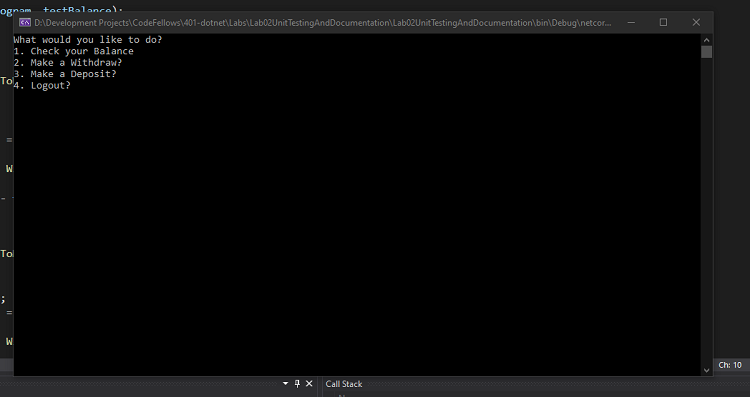
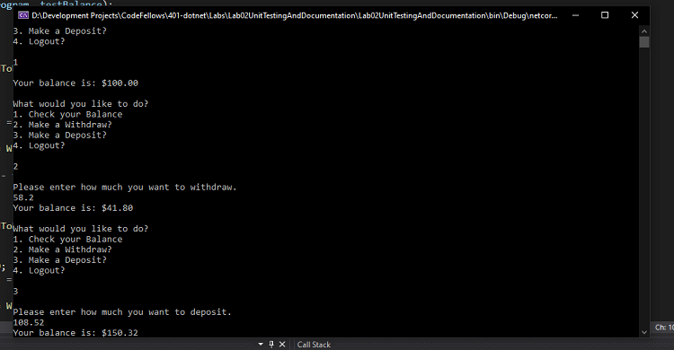
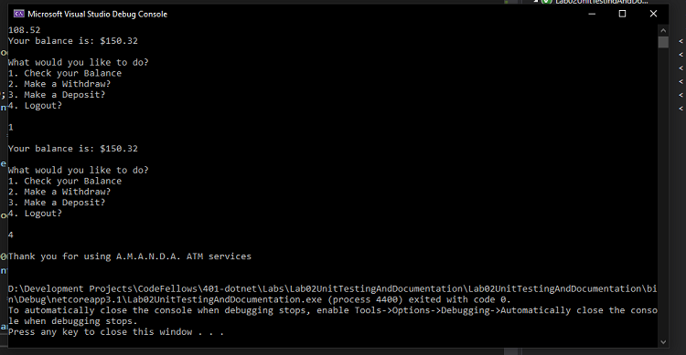

# Lab: 02 - Unit Tests & Documentation

## About Me

*Author: Trevor Stubbs*

----

## Description 
This is a C# console application that will allow the user to check their bank balance, deposit money into their account and to withdraw money from their account.

---

### Getting Started
Clone this repository to your local machine.

```
$ git clone https://github.com/TrevorStubbs/Lab02-UnitTestingAndDocumentation.git
```

### To run the program from Visual Studio:
Select ```File``` -> ```Open``` -> ```Project/Solution```

Next navigate to the location you cloned the Repository.

Double click on the ```Lab02UnitTestingAndDocumentation``` directory.

Then select and open ```Lab02UnitTestingAndDocumentation.sln```

---

### Visuals *TODO*
#### Application Start

#### Using the Application

#### Application End


---

### Change Log
- 1.0: Initial Repo Setup
- 1.1: Solution Outline
- 1.2: UserInterface Method Outline Complete
- 1.3: ViewBalance Method Complete
- 1.4: Withdraw Method Complete
- 1.5: Deposit Method Complete